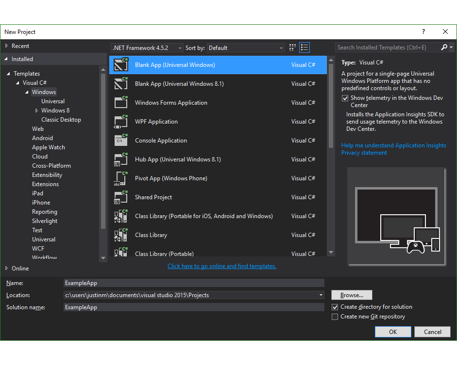

<p align="center" >

</p>

## Particle Cloud SDK and Device Setup Library basic Windows app example

1. Open Visual Studio 2015 and create a new project - Blank App (Universal Windows)


2. Click Tools -> NuGet Package Manager -> Package Manager Console


3. Enter `Install-Package Particle.SDK`


4. Enter `Install-Package Particle.Setup`


5. Open `MainPage.xaml` and add the following between the `<Grid>` tags:
```
<Grid.RowDefinitions>
    <RowDefinition Height="*" />
    <RowDefinition Height="200" />
</Grid.RowDefinitions>
<StackPanel Margin="0,50,0,0">
    <TextBox x:Name="usernameTextBox" InputScope="EmailSmtpAddress" PlaceholderText="username" />
    <PasswordBox x:Name="passwordTextBox" PlaceholderText="password" />
    <Button x:Name="loginButton" Content="Login" Click="loginButton_Click" />
    <ListBox x:Name="deviceListBox" ItemsSource="{Binding}" MaxHeight="200">
        <ListBox.ItemTemplate>
            <DataTemplate>
                <TextBlock Grid.Row="0" Text="{Binding Name}" />
            </DataTemplate>
        </ListBox.ItemTemplate>
    </ListBox>
</StackPanel>
<ListBox x:Name="logListBox" Grid.Row="1" />
```

6. Open `MainPage.xaml.cs` and add `using Particle.SDK;` to the top of the `Usings` section

7. Open `MainPage.xaml.cs` and add the following inside the `MainPage` class:
```
private async void loginButton_Click(object sender, RoutedEventArgs e)
{
    logListBox.Items.Insert(0, "Login");
    bool success = await ParticleCloud.SharedCloud.LoginAsync(usernameTextBox.Text, passwordTextBox.Password);
    logListBox.Items.Insert(0, $"Login: {success}");
    if (!success)
        return;

    logListBox.Items.Insert(0, "GetDevices");
    var devices = await ParticleCloud.SharedCloud.GetDevicesAsync();
    logListBox.Items.Insert(0, $"GetDevices: {devices.Count} devices");

    deviceListBox.DataContext = devices;
}
```

8. Press `F5`

9. Enter your credentials in the `username` and `password` field then click `Login`
